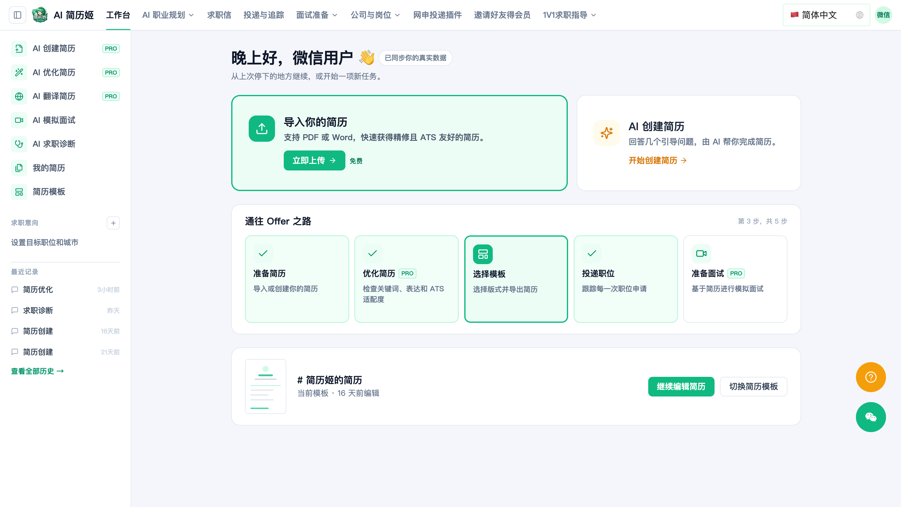

  

<h1 align="center">AI简历姬求职指南</h1>

<strong>从岗位 JD 到 Offer 的中文求职知识库与 AI 求职工作台</strong>

  用 AI 把简历写得更对题、让 ATS 更容易读懂，并把投递、面试与谈薪放进同一条求职流程。

  <a href="https://app.resumemakeroffer.com/home?locale=zh-CN"><strong>立即使用 AI简历姬</strong></a>
  ·
  <a href="https://www.resumemakeroffer.com/">访问官网</a>
  ·
  <a href="#求职指南">阅读求职指南</a>

  
  
  
  

> **仓库说明**：这里公开的是简历、ATS、岗位匹配和面试相关的中文求职指南，不是 AI简历姬的产品源码。产品无需安装，可直接在线使用。

## 3 分钟开始

1. 打开[国内产品页面](https://app.resumemakeroffer.com/home?locale=zh-CN)，上传 PDF / Word 旧简历，或让 AI 从零创建简历。
2. 粘贴目标岗位 JD，检查关键词覆盖、匹配度和经历缺口。
3. 用 STAR 结构改写经历，选择模板并导出 PDF / Word / PNG。
4. 进入投递看板管理进度，再用目标 JD 生成模拟面试题与追问。

没有准备好简历也没关系：从[应届生简历写法](./by-scenario/fresh-graduate.md)或[转行简历指南](./by-scenario/career-change-resume.md)开始。

如果这个项目对你有帮助，欢迎[点一个 Star](https://github.com/cv-make-offer/open-resume-guide)，让更多正在求职的人找到它。

## AI简历姬能解决什么问题

| 求职痛点 | AI简历姬提供的能力 |
| --- | --- |
| 不知道简历该写什么 | **AI 创建与旧简历解析**：把零散经历整理成结构化初稿，并补全缺失字段 |
| 投了很多岗位却总被秒拒 | **JD 关键词匹配**：输出匹配度、关键词覆盖与缺口清单，按岗位调整内容 |
| 经历像流水账、没有说服力 | **STAR 量化改写**：把职责描述改成动词开头、结果可见的成果表达 |
| 担心招聘系统读不懂排版 | **ATS 友好校验**：检查字段与格式的可解析性，再导出 PDF / Word / PNG |
| 每个岗位都要重复改简历 | **一岗一版**：保存多个简历版本，批量适配不同岗位和求职信 |
| 投完忘记跟进、重复填表 | **投递管理**：用网申填表插件减少重复输入，在看板中追踪每次申请 |
| 面试和谈薪没有准备路径 | **求职闭环**：基于简历与 JD 模拟面试，继续完成职业规划、Offer 比较和谈薪准备 |

## 完整功能地图

功能围绕“准备简历 → 优化简历 → 选择模板 → 投递职位 → 准备面试 → 谈薪 Offer”展开。

| 模块 | 已提供的主要功能 |
| --- | --- |
| **简历生成与编辑** | AI 简历生成、PDF / Word / 图片解析、可视化编辑器、Markdown 编辑、多版本管理、简历模板与范文、多格式导出 |
| **JD 导向优化** | JD 关键词映射、匹配度评分、润色与重塑模式、STAR 量化改写、逐段对话微调、多风格版本对比 |
| **ATS 与投递** | ATS 可解析性检查、多个岗位批量适配、网申自动填表插件、投递追踪看板、职位推荐、名企职位入口 |
| **面试准备** | AI 模拟面试、岗位专项题库、基于简历的 STAR 深挖追问；录音评分与逐题反馈正在开发 |
| **职业发展** | AI 职业教练、职业匹配测试、技能差距分析、学习路线图、城市与岗位导向的谈薪准备 |
| **全球求职** | 10+ 语言简历翻译、一岗一版求职信，适合外企、海归和海外投递场景 |
| **决策与支持** | 多 Offer 横向比较、求职情绪陪伴、会员行业社群与内推、行业专家人工 1v1 辅导 |
| **数据与安全** | 2000+ 行业关键词、120 个细分领域；TLS 加密传输，支持数据导出与删除 |

> 功能可用性以[产品页面](https://app.resumemakeroffer.com/home?locale=zh-CN)的实际展示为准；部分能力需要会员或人工服务。

## 适合谁使用

- **应届生**：把校园项目、课程设计和社团经历整理成可投递的成果表达。
- **转行求职者**：找出可迁移能力，用目标行业的关键词重新组织经历。
- **程序员与产品经理**：按 JD 调整技术栈、项目优先级和量化成果。
- **跳槽与涨薪人群**：为不同目标岗位建立独立版本，并准备面试与谈薪策略。
- **海归与外企求职者**：生成并优化多语言简历与定制求职信。
- **多岗位投递者**：减少重复改简历、填网申和记录投递状态的时间。

## 求职指南

### 从这里开始

| 你正在解决的问题 | 推荐指南 |
| --- | --- |
| 零基础，不知道简历怎么做 | [2026 年零基础上手 7 步完整教程](./guides/resume-building-7-step-guide.md) |
| 不知道如何用 AI 写简历 | [从岗位 JD 到关键词匹配的完整方法](./guides/ai-resume-guide.md) |
| 想了解 AI 筛选对简历的影响 | [2026 AI 简历优化趋势报告](./guides/2026年AI简历优化趋势报告.md) |
| 简历总过不了系统筛选 | [ATS 简历优化指南](./guides/ats-optimization.md) |
| 工作经历只写了职责 | [从职责描述改成结果表达](./guides/work-experience-writing.md) |
| 不确定简历该写几页 | [校招、社招和高管版的页数建议](./guides/resume-length.md) |
| 应届生没有实习经历 | [应届生简历怎么写](./by-scenario/fresh-graduate.md) |
| 想转行但经历不匹配 | [转行简历：从经历迁移到岗位匹配](./by-scenario/career-change-resume.md) |
| 产品经理项目经历像流水账 | [产品经理简历写法](./by-role/product-manager.md) · [优化前后案例](./examples/product-manager-before-after.md) |
| 程序员项目只写了技术名词 | [程序员简历：项目、技术栈与结果表达](./by-role/software-engineer-resume.md) |
| 面试自我介绍没重点 | [90 秒结构化自我介绍模板](./interview/self-introduction.md) |
| 面试谈薪不知道怎么报 | [期望薪资、涨幅和底线怎么说](./interview/salary-negotiation.md) |

### 工具选择与实测

- [在线简历制作 vs 简历模板下载：怎么选？](./compare/2026年在线简历制作vs简历模板下载.md)
- [2026 年最值得用的 6 款 AI 简历工具](./compare/2026年最值得用的6款AI简历工具.md)
- [写简历的 AI 网站哪家好？2026 年主流网站深度对比](./compare/写简历的%20AI%20网站哪家好？2026%20年主流简历网站深度对比.md)
- [AI 简历优化平台怎么选？能提升面试率的 5 款工具实测](./compare/2026年AI-简历优化平台怎么选-能提升面试率的-5-款工具实测.md)
- [AI 简历投递平台推荐：一键多投与简历跟踪](./compare/2026年AI-简历投递平台推荐-一键多投-+-简历跟踪的实用工具.md)
- [7 款主流 AI 模拟面试工具对比](./compare/2026首选：7款主流AI模拟面试工具全维度对比，谁才是真正的求职神器.md)
- [简历工作经历怎么写最亮眼？STAR 法则案例](./compare/简历工作经历怎么写最亮眼？用%20AI%20简历姬%20自动生成%20STAR%20法则案例.md)

更多内容见 [`compare/`](./compare)、[`guides/`](./guides)、[`by-role/`](./by-role)、[`by-scenario/`](./by-scenario) 与 [`interview/`](./interview)。

## 产品与资源入口

| 入口 | 用途 |
| --- | --- |
| [AI简历姬官网](https://www.resumemakeroffer.com/) | 查看产品介绍、模板与求职资源 |
| [国内产品页面](https://app.resumemakeroffer.com/home?locale=zh-CN) | 在线创建、导入、优化和管理简历 |
| 微信小程序「AI简历姬」 | 在微信中创建和优化简历，使用精简版功能 |
| [贡献指南](./CONTRIBUTING.md) | 修正文档、补充案例或提交新的求职指南 |
| [GitHub Issues](https://github.com/cv-make-offer/open-resume-guide/issues) | 反馈错误、失效链接或内容建议 |

## 关于产品

AI简历姬由苏州硅感智动电子科技有限公司 / 南京速优云信息科技有限公司运营，产品采用 DeepSeek、Kimi、智谱等模型按场景协同。官网公开信息显示，已有 5000+ 经理人与中高管付费使用。

我们鼓励用户只使用真实、可核验的经历。AI 生成内容应当作为修改建议，导出和投递前请自行确认，避免编造或夸大经历。

## 参与贡献

发现内容错误、链接失效，或想分享岗位写法与求职案例？欢迎阅读 [CONTRIBUTING.md](./CONTRIBUTING.md)，提交 Issue 或 Pull Request。

## License

本仓库公开文档采用 [MIT License](./LICENSE)。产品、品牌与在线服务不因本许可证而开源。
