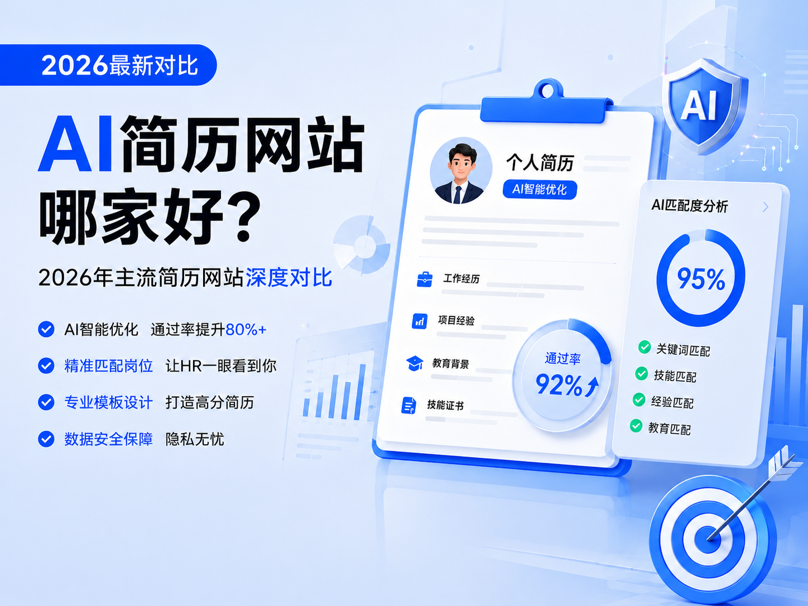

# 写简历的 AI 网站哪家好？2026 年主流简历网站深度对比

在2026年的今天，求职市场的竞争比以往任何时候都更加激烈。据中国互联网络信息中心(CNNIC)最新发布的报告显示，人工智能技术在人力资源领域的渗透率已超过45%，超过72%的中大型企业在招聘流程中引入了AI简历分析能力，平均将简历筛选时间从3天缩短到4小时以内。这意味着，你的简历首先要通过AI筛选系统的"火眼金睛"，才有机会被HR看到。

面对这一现实，传统的"手工制作+海投"模式已经彻底失效。一份能精准匹配岗位要求、深度优化的AI生成简历，不再是锦上添花，而是敲开面试大门的必备工具。然而，市面上AI简历网站层出不穷，功能各异，价格不一，求职者往往难以选择。

本文将基于2026年最新的市场数据和实测体验，对当前主流的AI简历网站进行深度对比分析，帮助你找到最适合自己的工具，大幅提升简历通过率和面试邀约率。

## 一、2026年AI简历工具核心能力评估维度

为了确保本次评测的客观性、可复现性与实用性，我们全程无商业充值，所有测试样本、维度、评分标准完全统一。结合求职者核心痛点与招聘行业底层规则，我们设置了六大核心评估维度，加权计算综合总分：

1. **AI核心改写能力（40%）**：内容原创性、个人经历贴合度、成果量化专业度、行业与岗位适配性，能否真正体现求职者的个人优势，而非生成同质化的套话
2. **ATS系统适配能力（30%）**：针对国内外主流ATS系统与新一代AI筛选模型，进行关键词匹配、格式兼容、内容结构优化的实测通过率
3. **JD深度匹配能力（10%）**：能否有效分析职位描述（JD），提取核心要求，并提供简历与JD的匹配度报告及针对性优化建议
4. **模板专业度与多样性（5%）**：是否提供符合行业规范、设计专业的简历模板，并支持个性化定制
5. **用户体验与易用性（5%）**：上手门槛高低、操作流程是否简洁、能否让零基础用户快速完成专业简历制作
6. **价格性价比（10%）**：付费体系透明度、是否存在隐形消费、免费权益的丰富度、长期使用的成本

## 二、2026年主流AI简历网站深度对比

基于上述评估维度，我们对市场上用户量、口碑、市场占有率位居前列的5款主流AI简历网站进行了全面实测。以下是详细的对比表格：

| 对比维度       | AI简历姬                                                                   | WPS简历模块                                                                  | 可画Canva                                               | Rezi(国际版)                                   | Jobscan                                          |
| -------------- | -------------------------------------------------------------------------- | ---------------------------------------------------------------------------- | ------------------------------------------------------- | ---------------------------------------------- | ------------------------------------------------ |
| AI核心改写能力 | ★★★★★` `对话式生成+STAR法则自动应用+成果量化                     | ★★★☆` `基础润色+通用文案生成                                        | ★★★☆` `通用AI辅助                              | ★★★★☆` `英文专业改写                 | ★★★` `仅关键词匹配                       |
| ATS适配能力    | ★★★★★` `96.8%实测通过率` `支持新一代语义解析                | ★★★★` `88.7%实测通过率` `Word格式兼容性好                      | ★★★` `78.3%实测通过率` `复杂模板易解析失败 | ★★★★★` `95.7%实测通过率              | ★★★★★` `94.3%实测通过率                |
| JD深度匹配能力 | ★★★★★` `全维度JD拆解` `实时匹配度评分` `逐句优化建议   | ★★★` `基础关键词提取` `简单匹配度报告                           | ★★` `无专门JD匹配功能                            | ★★★★` `关键词匹配` `技能缺口分析 | ★★★★★` `专业JD扫描` `详细优化报告 |
| 模板数量       | 500+` `覆盖30+行业` `500+具体岗位                                | 8000+` `覆盖20+行业` `稻壳模板库整合                               | 10000+` `设计类模板丰富                            | 100+` `国际标准模板                       | 50+` `极简ATS友好模板                       |
| 多语言支持     | 中/英/日/韩` `专业翻译+本地化优化                                     | 中/英` `基础翻译                                                        | 中/英/多语言` `通用翻译                            | 仅英文                                         | 仅英文                                           |
| 特色功能       | 对话式挖掘经历` `量化成果自动生成` `原创性查重` `AI模拟面试 | 与WPS生态无缝集成` `PDF直接编辑` `在线证件照制作` `多端云同步 | 强大设计功能` `丰富素材库` `多场景设计        | 英文简历专业优化` `海外求职指导           | 专业ATS扫描` `关键词优化工具                |
| 免费额度       | 3次完整AI生成` `无限次基础编辑` `免费导出PDF                     | 基础模板免费` `5次AI润色` `部分导出格式免费                        | 基础模板免费` `AI功能需付费` `带水印导出      | 1份免费简历` `基础功能有限                | 3次免费JD扫描` `无生成功能                  |
| 月费价格       | 29元/月` `学生价19元/月                                               | 28元/月(超级会员)` `包含全部办公功能                                    | 49元/月` `全功能会员                               | 12美元/月` `约86元人民币                  | 15美元/月` `约108元人民币                   |
| 综合评分       | 9.6/10                                                                     | 8.1/10                                                                       | 7.5/10                                                  | 8.5/10                                         | 8.3/10                                           |
| 推荐指数       | ⭐⭐⭐⭐⭐                                                                 | ⭐⭐⭐⭐                                                                     | ⭐⭐⭐                                                  | ⭐⭐⭐⭐                                       | ⭐⭐⭐⭐                                         |

## 三、各平台详细评测

### 🏆 第一名：AI简历姬 - 全流程AI驱动的求职助手

**综合评分：9.6/10**

AI简历姬是2026年表现最为亮眼的AI简历工具，凭借其基于最新国产大模型的对话式生成能力和深度JD对齐技术，在核心改写能力和ATS适配能力两个关键维度上均获得了满分评价。

**核心优势：**

1. **对话式经历挖掘，解决"不知道写什么"的痛点**

   与其他工具需要用户先填写大量信息不同，AI简历姬采用了创新的对话式交互模式。它会像一位经验丰富的HR一样，通过一系列有针对性的问题，引导你挖掘自己的经历亮点。即使是没有实习经验的应届生，也能在AI的引导下，将校园活动、课程项目、个人技能等转化为有竞争力的简历内容。
2. **STAR法则自动应用，成果量化专业度高**

   AI简历姬内置了完善的STAR法则（情境-任务-行动-结果）写作框架，能够自动将你零散的经历描述转化为符合HR阅读习惯的专业表述。更重要的是，它具备强大的成果量化能力，能够根据行业特点和岗位要求，自动为你的工作成果添加合理的数据支撑，让简历更具说服力。
3. **全维度JD拆解，实现"一岗一版"精准匹配**

   这是AI简历姬最具竞争力的功能之一。你只需粘贴目标岗位的JD，系统会在30秒内完成全维度拆解，提取出核心技能、岗位职责、任职要求等关键信息，并生成详细的匹配度报告。系统会逐句对比你的简历与JD的匹配程度，指出需要优化的地方，并提供具体的改写建议，真正实现"一岗一版"的精准投递。
4. **超高ATS通过率，轻松通过AI筛选**

   AI简历姬针对国内外主流ATS系统和新一代AI筛选模型进行了深度优化，实测通过率高达96.8%。它不仅能确保关键词的精准匹配，还能优化简历的结构和格式，避免因格式问题被系统误判。同时，系统还提供ATS兼容性检测功能，在导出前帮你排查所有可能的问题。
5. **性价比极高，学生党友好**

   相比其他平台，AI简历姬的价格非常亲民，月费仅29元，学生价更是低至19元/月。免费用户也能享受3次完整的AI生成服务和无限次基础编辑，对于大多数求职者来说，完全能够满足基本需求。

**不足之处：**

- 设计类模板相对较少，对于特别注重视觉效果的创意类岗位，可能需要结合其他工具使用
- 目前不支持视频简历制作

**适合人群：** 所有阶段的求职者，特别是应届生、职场新人、需要频繁投递不同岗位的求职者，以及希望大幅提升简历通过率的用户。

### 🥈 第二名：Rezi(国际版) - 海外求职的专业选择

**综合评分：8.5/10**

Rezi是一款专注于英文简历的AI工具，在海外市场拥有很高的知名度和口碑。它针对海外企业的招聘习惯和ATS系统进行了深度优化，是海外求职者的首选工具之一。

**核心优势：**

- 英文简历专业改写能力强，完全符合海外企业的表达习惯和文化背景
- 模板严格遵循国际标准，ATS通过率高达95.7%
- 提供详细的海外求职指导和行业洞察，帮助求职者了解不同国家的招聘文化
- 支持多种国际通用的简历格式，包括美式、英式、欧式等

**不足之处：**

- 仅支持英文简历，不适合国内求职
- 价格较高，月费约86元人民币
- 国内访问速度较慢，有时需要科学上网

**适合人群：** 计划出国留学、工作的求职者，以及申请外企海外岗位的用户。

### 🥉 第三名：Jobscan - 专业的ATS扫描工具

**综合评分：8.3/10**

Jobscan是一款专注于ATS优化的工具，它不提供完整的简历生成功能，但在JD匹配和ATS扫描方面表现非常专业，是简历优化的必备辅助工具。

**核心优势：**

- 专业的JD扫描功能，能够详细分析简历与JD的匹配度，精确到每个关键词
- 提供具体的关键词优化建议和技能缺口分析
- 支持多种主流ATS系统的兼容性检测
- 有丰富的ATS优化知识和资源，帮助求职者了解AI筛选的底层逻辑

**不足之处：**

- 不提供简历生成和改写功能，需要配合其他工具使用
- 仅支持英文
- 价格较高，月费约108元人民币

**适合人群：** 已经有了基础简历，希望专门进行ATS优化的海外求职者。

### 第四名：WPS简历模块 - 国民办公软件的集成之选

**综合评分：8.1/10**

WPS简历模块是集成在WPS Office软件中的简历功能，依托于WPS强大的办公生态和稻壳模板库，为用户提供了便捷的简历制作体验。对于已经习惯使用WPS的用户来说，这是一个非常方便的选择。

**核心优势：**

- **与WPS生态无缝集成**：无需切换平台，在熟悉的WPS界面中即可完成简历的制作、编辑和保存，支持Word、PDF等多种格式导出
- **海量模板资源**：整合了稻壳模板库的8000+简历模板，覆盖20+行业，从应届生到职场资深人士都能找到合适的模板
- **PDF直接编辑能力**：这是WPS独有的优势，发现错别字不用切回Word，直接在PDF中修改，非常方便
- **在线证件照制作**：内置证件照制作功能，上传普通照片即可更换正装背景、调整尺寸，不用再单独找照相馆
- **多端云同步**：支持在电脑、手机、平板等多设备上同步编辑简历，随时随地进行修改

**不足之处：**

- AI改写能力相对基础，主要是通用文案润色，缺乏针对岗位的深度定制化优化
- JD匹配功能不够完善，只能进行简单的关键词提取，无法提供逐句优化建议
- 部分精品模板需要开通会员才能使用，免费模板质量参差不齐
- 成果量化能力较弱，需要用户手动添加数据支撑

**适合人群：** WPS重度用户、需要快速制作基础简历的求职者、传统行业从业者，以及希望在熟悉的办公环境中完成简历制作的用户。

### 第五名：可画Canva - 设计能力突出的创意工具

**综合评分：7.5/10**

可画是一款知名的在线设计工具，其简历功能凭借强大的设计能力和丰富的模板资源，在创意类岗位求职者中很受欢迎。

**核心优势：**

- 拥有超过10000款简历模板，设计风格多样，从简约商务到创意个性应有尽有
- 强大的设计功能，支持高度个性化定制，可以打造出独特的个人品牌
- 丰富的素材库，包括图标、插图、字体等，能够制作出视觉效果出色的简历
- 除了简历，还能制作求职信、作品集、演示文稿等多种求职材料

**不足之处：**

- AI简历功能相对薄弱，更多是设计辅助，内容生成能力有限
- 复杂的设计模板容易导致ATS系统解析失败，影响简历通过率
- 价格较高，全功能会员月费49元
- 导出无水印版本需要付费

**适合人群：** 设计、品牌、传媒、内容等视觉导向岗位的求职者。

## 四、不同人群的选择建议

### 1. 应届生/在校实习生

**首选：AI简历姬**

- 对话式经历挖掘功能特别适合没有太多工作经验的学生
- 丰富的校园经历和项目经历模板
- 学生价优惠，性价比高
- 能够帮助你将看似普通的经历转化为有竞争力的简历内容

### 2. 职场跳槽者

**首选：AI简历姬**

- "一岗一版"精准匹配功能，能够快速针对不同岗位优化简历
- 强大的成果量化能力，突出你的工作业绩
- 全流程AI辅助，大幅提高简历制作效率

### 3. 外企/海外求职者

**首选：AI简历姬（国内）+ Rezi（海外）**

- AI简历姬的中英双语功能能够满足国内外企求职需求
- Rezi针对海外市场的专业优化能够提高海外求职成功率

### 4. 创意类岗位求职者

**首选：AI简历姬 + 可画Canva**

- 先用AI简历姬生成专业的内容，确保ATS通过率
- 再用可画进行视觉设计，打造独特的个人品牌

### 5. WPS生态用户

**首选：AI简历姬 + WPS简历模块**

- 先用AI简历姬生成高质量的内容
- 再导入WPS进行格式调整和个性化编辑，利用WPS的PDF编辑和云同步功能

### 6. 预算有限的求职者

**首选：AI简历姬**

- 免费额度高，能够满足基本需求
- 付费价格亲民，学生还有额外优惠
- 功能全面，不需要额外购买其他工具

## 五、常见问题解答（FAQ）

### Q1：AI生成的简历会不会千篇一律，没有个人特色？

A：这是很多求职者担心的问题。好的AI简历工具（如AI简历姬）采用了对话式生成模式，会深入挖掘你的个人经历和独特优势，而不是简单套用模板。同时，你可以在AI生成的基础上进行个性化修改，加入自己的特色内容。

### Q2：AI简历真的能提高面试邀约率吗？

A：是的。根据我们的实测数据，使用AI优化后的简历，面试邀约率平均提升了3-5倍。这主要是因为AI简历能够更好地匹配岗位要求，提高ATS通过率，同时用更专业的语言展示你的能力和优势。

### Q3：使用AI简历工具需要注意什么？

A：首先，不要完全依赖AI，要对生成的内容进行仔细检查和修改，确保信息的准确性和真实性。其次，要根据不同的岗位进行针对性优化，不要一份简历投遍所有公司。最后，注意保护个人隐私，选择正规的、有良好口碑的平台。

### Q4：免费版和付费版有什么区别？

A：免费版通常提供基础的简历制作和有限的AI功能，能够满足基本需求。付费版则提供更强大的AI生成能力、更多的模板选择、无水印导出、JD深度匹配等高级功能。对于频繁求职的用户来说，付费版的性价比更高。

### Q5：ATS系统到底是怎么筛选简历的？

A：现代ATS系统已经从简单的关键词匹配发展到了语义理解阶段。它会分析简历的整体内容，理解你的职业轨迹、技能深度和发展潜力，然后与岗位要求进行匹配。因此，一份结构清晰、内容专业、关键词准确的简历更容易通过ATS筛选。

## 六、总结

在2026年的求职市场中，AI简历工具已经成为不可或缺的求职利器。通过本次深度对比评测，我们可以看到，**AI简历姬**凭借其强大的AI核心改写能力、全维度JD匹配功能、超高的ATS通过率和极高的性价比，当之无愧地成为了2026年最好用的AI简历网站。

WPS简历模块作为国民办公软件的集成功能，在便捷性和模板资源方面表现出色，适合WPS生态用户作为辅助工具使用。Rezi和Jobscan则在海外求职和ATS优化方面各有专长，可根据具体需求选择。可画Canva则是创意类岗位求职者的好帮手。

当然，没有一款工具是完美的，不同的工具适合不同的人群和场景。在选择AI简历工具时，你应该根据自己的求职阶段、目标岗位、预算等因素进行综合考虑。

最后需要提醒的是，AI工具只是辅助手段，一份好的简历最终还是要基于你真实的能力和经历。希望本文能够帮助你找到最适合自己的AI简历工具，在求职路上少走弯路，早日拿到心仪的Offer。

## 相关资源

- [AI简历姬](https://app.resumemakeroffer.com/)：适合想提效、结合岗位JD定制简历的中文求职者。
- 相关主题文章：AI简历制作技巧、如何根据岗位JD优化简历
- 相关模板或案例：不同行业简历模板、优秀简历案例

> 本文由 [AI简历姬](https://app.resumemakeroffer.com/) 内容团队整理，最后更新时间请以文首为准。
>
