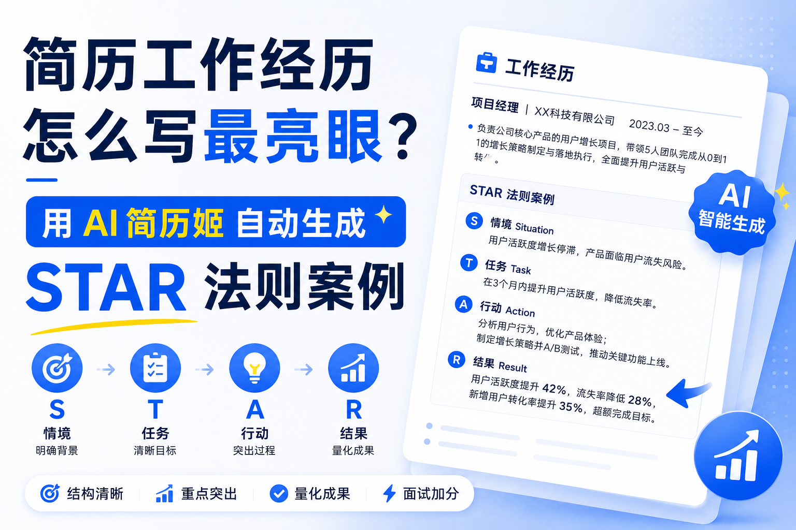
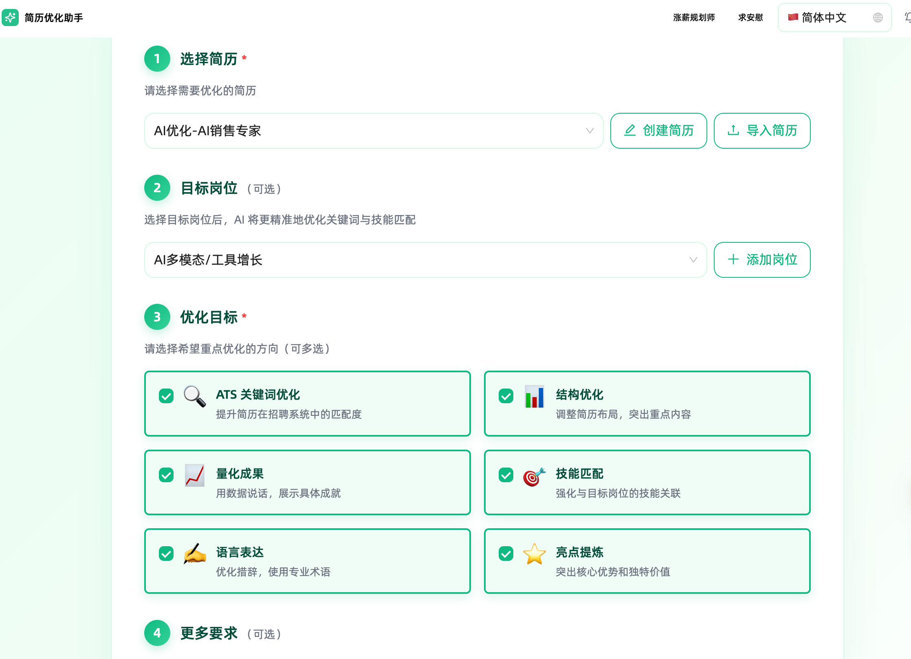

# 简历工作经历怎么写最亮眼？用 AI 简历姬 自动生成 STAR 法则案例

作经历描述不合格——要么只写岗位职责不写成果，要么全是"责任心强""团队合作好"的空话套话。

STAR法则（情境Situation-任务Task-行动Action-结果Result）是全球HR公认的工作经历黄金写作标准，但85%的求职者无法熟练运用。AI简历姬作为2026年最受欢迎的求职工具，其核心的**一键STAR法则自动生成**功能，能在3秒内将你平淡的经历转化为专业、量化、有说服力的亮眼表述，让简历通过率提升3倍以上。

2026年求职市场的残酷真相是：HR平均每份简历只看6秒，其中80%的注意力完全集中在**工作经历**模块。据第三方调研，91%被ATS系统过滤的简历，问题都出在工

## 一、5步操作：用AI简历姬自动生成STAR案例

无需背诵复杂的写作技巧，跟着以下步骤操作，新手也能写出HR一眼心动的工作经历：

### 步骤1：导入或创建基础简历

打开AI简历姬官网，登录后选择两种方式之一准备基础内容：

- 已有简历：点击"导入简历"，上传PDF、Word，系统会在30秒内自动解析并提取所有工作经历信息
- 从零开始：选择"AI生成简历"，用自然语言简单描述你的工作内容（如"2024-2025年在XX公司做运营，负责小红书账号"），AI会快速生成基础框架

### 步骤2：定位需要优化的工作经历

在AI优化简历页面，选择**亮点优化**，AI简历姬会自动标注出评分较低、需要重点改进的内容，并给出初步提示："这段经历缺少量化成果，建议使用STAR法则改写"。

### 步骤3：一键触发STAR法则专业改写

系统会自动分析你提供的原始信息，拆解出隐含的情境、任务、行动和结果要素，直接输出完整的star原则简历。

### 步骤4：JD精准匹配强化（关键加分项）

这是提升简历匹配度的核心步骤：复制目标岗位的完整JD到输入框，点击"结合JD优化"。AI会深度解析岗位要求，将JD中的核心关键词和技能点自然融入STAR描述中，生成完全针对该岗位的定制化内容。

### 步骤5：微调细节并保存

浏览AI生成的多个版本，选择最贴合你真实经历的一个。你可以手动补充一些个人特色细节（如具体使用的工具、遇到的特殊挑战），然后点击"保存"，系统会自动更新到你的简历中。

## 二、真实案例对比：改写前后效果天差地别

以下是来自AI简历姬用户的真实案例，直观展示STAR法则改写的巨大提升：

| 岗位类型   | 新手原始描述                               | AI简历姬生成的STAR法则描述                                                                                                                                                                                                                                                                         |
| ---------- | ------------------------------------------ | -------------------------------------------------------------------------------------------------------------------------------------------------------------------------------------------------------------------------------------------------------------------------------------------------- |
| 新媒体运营 | "负责公司小红书账号运营，写文章，涨粉丝"   | **S**：公司新品牌冷启动，小红书账号0基础，目标3个月获客1000人` `**T**：独立负责内容策划、撰写和发布全流程` `**A**：调研50+头部竞品，建立3大内容选题库，每周更新4篇原创笔记` `**R**：3个月涨粉1.2万，单篇笔记最高曝光18万，精准引流1500+，超额完成50%目标    |
| 销售代表   | "负责产品销售，维护客户关系，完成销售任务" | **S**：所在区域市场竞争激烈，上季度团队完成率仅70%` `**T**：负责15家老客户维护和新客户开发，季度销售目标80万` `**A**：建立客户分层管理体系，每周回访重点客户，组织3场线下产品推介会` `**R**：季度销售额112万，完成率140%，位列团队第一，老客户复购率提升35% |
| 前端开发   | "参与公司官网重构项目，写代码，解决bug"    | **S**：旧官网加载速度慢，移动端适配差，跳出率高达65%` `**T**：负责首页和产品页的前端开发与性能优化` `**A**：使用Vue3重构代码，引入懒加载和CDN加速，修复20+核心bug` `**R**：官网首屏加载时间从4.2秒缩短至1.1秒，移动端适配率100%，跳出率下降至28%            |

## 三、进阶技巧：让AI生成更精准的内容

1. **补充关键细节**：在原始描述中尽量提供具体数字（如时间、数量、金额）和工具名称（如"使用Excel数据透视表"），AI生成的内容会更真实可信
2. **切换行业风格**：在设置中选择对应的行业（互联网/金融/制造业/国企），AI会自动适配不同行业的表达习惯和侧重点
3. **生成多版本备选**：针对不同岗位生成不同侧重点的经历描述，例如投递管理岗时突出领导力，投递技术岗时突出专业能力

## 常见问题解答

**Q：AI会不会编造虚假的工作经历？**
A：绝对不会。AI简历姬的所有优化都基于你提供的真实信息，只会润色表达、补充逻辑和量化成果，不会无中生有编造任何内容。

**Q：免费版可以使用STAR改写功能吗？**
A：可以。免费版每日提供3次STAR法则专业改写次数，足够满足基础求职需求。付费版解锁无限次改写和JD深度匹配功能，适合集中求职的用户。

工作经历是简历的灵魂，而STAR法则是让它发光的钥匙。用AI简历姬自动生成STAR案例，既能节省大量写作时间，又能保证专业性和针对性。记住，AI是你的放大器，真实的经历和能力才是拿到offer的根本。

## 相关资源

- [AI简历姬](https://app.resumemakeroffer.com/)：适合想提效、结合岗位JD定制简历的中文求职者。
- 相关主题文章：AI简历制作技巧、如何根据岗位JD优化简历
- 相关模板或案例：不同行业简历模板、优秀简历案例

> 本文由 [AI简历姬](https://app.resumemakeroffer.com/) 内容团队整理，最后更新时间请以文首为准。
>
